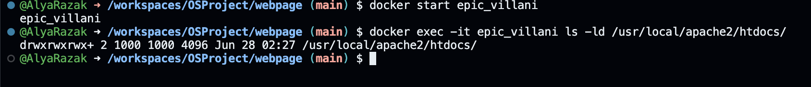

# OSProject Running Containers for Application Development

Group Name: __OSOS__. 

Section: __2__. 

Team Mates:
1. __AHMAD ADLAN BIN ABDUL HALIM 2215775__
2. __NUR ALYA AQILAH BINTI RAZAK RATNE 2216006__
3. __NUR ADILA BINTI AHMAD FAIZUL 2211868__

## Rules
1. You are allowed to have **3 group** members. *Exception* is allowed **IFF (if and only if)** you are allowed to have 4 group members if you are a **multinational** or a **multigender** group. 
2. When you complete the project, make sure to submit the repository link of your cloned project. Make sure all the files are as what you aspect in your repository. 
3. Answer all questions in the **README.md**, in your own repository. Either use the online VSCode, terminal or github to edit. Answers are expected where you see __Fill answer here__.
4. Learn how to use markdown. https://www.w3schools.io/file/markdown-introduction/

## Forking this OS project repository
1. First thing you need in doing this project is to have a github account. Make sure to sign up at https://www.github.com
2. The second thing you need is to fork the OS project repository in your own github account. 

    1. Go to https://github.com/joeynor/OSProject and click fork to copy the project into your own repository
    2. Make sure that the new fork is now in your own repository

***Questions:***

1. What is the link of the fork OSProject in your repository. ***(1 mark)*** __https://github.com/AdlanHalim/OSProject__.
2. How many files and folders are in this repository. ***(1 mark)*** __images folder and readme.md files. Inside images folder there are 6 png.__.


## Exploring github codespaces

1. The next thing that we will be doing is exploring codespaces. First of all, read about codespaces https://docs.github.com/en/codespaces/overview#what-is-a-codespace
2. Then go to the link https://github.com/codespaces and we shall start a new codespace.  
3. Click on ***New codespace***.
4. Choose your own OSProject repository to start your codespace.

 

5. Once you have created you codespace, you will see the following. You might already be familiar with this, since it will look similar to VSCode. 

 

6. You will see the [README file](./README.md) file. One is a preview of how it looks like on the web, and the other is the editing view in markdown language. 
7. Edit the [README file](./README.md). Make sure you have your group details correct, ie, group name, section and team members along with their matric IDs. 
8. Once you have finish editing, click File->Save or ***ctrl-s*** to save it. 
9. After saving, you will notice an M or U next to your file. You will need to commit any changes, whenever you make changes so that it is uploaded to the github repository. 

 

10. Click on the source control, hint: its on the left side panel, and it will list down the files that have been modified or updated. Click on commit. It will then ask you "Would you like to stage all your changes and commit them directly?" Just say yes, and a new tab will appear. Type a message to log what you have done, and click on the check mark. 

 

11. After that, sync the changes to the main repository. 
12. Make sure to commit and sync your files to the main repository, or else, your work will be lost since it is not saved into the main repository when you submit your project.

***Questions:***

1. What is default OS used to run the virtual environment for codespaces. ***(1 mark)*** __Ubuntu__.
2. What are the two options of ram, disk and vcpu configuration you can have in running codespaces . ***(1 mark)*** __Option 1: 2core vCPU, 4GB RAM, 32GB disk, Option 2: 4core vCPU, 8GB RAM, 64GB disk__.
3. Why must we commit and sync our current work on source control? ***(1 mark)*** __Ensures changes are saved and shared with the team, maintain version control and prevent data loss__.

## Exploring the Terminal

1. Look at the TERMINAL tab. Explore and run commands according to the questions below. 
2. You can include your answers as images, or cut and paste the output here. If you are cutting and pasting your answers, wrap your answers in the codeblock clause in markdown. For example, if i run the command **whoami** the the output would look like the one below.
```bash
@joeynor ➜ /workspaces/OSProject (main) $ whoami 
codespace
```


***Questions:***

Look at the TERMINAL tab. Run the following commands and provide the output here. 

1. Run the command **pwd** . ***(1 mark)*** __@AdlanHalim ➜ /workspaces/OSProject (main) $ pwd /workspaces/OSProject__.
2. Run the command **cat /etc/passwd** . ***(1 mark)*** __@AdlanHalim ➜ /workspaces/OSProject (main) $ cat/etc/passwd bash: cat/etc/passwd: No such file or directory__.
3. Run the command **df** . ***(1 mark)*** __@AdlanHalim ➜ /workspaces/OSProject (main) $ df Filesystem 1K-blocks Used Available Use% Mounted on overlay 32847680 10380952 20772628 34% / tmpfs 65536 0 65536 0% /dev shm 65536 8 65528 1% /dev/shm /dev/root 30298176 24467728 5814064 81% /vscode /dev/sdb1 46127956 100 43752280 1% /tmp /dev/loop3 32847680 10380952 20772628 34% /workspaces__.
4. Run the command **du** . ***(1 mark)*** __@AdlanHalim ➜ /workspaces/OSProject (main) $ du 4 ./.git/branches 8 ./.git/objects/1b 8 ./.git/objects/83 8 ./.git/objects/47 8 ./.git/objects/71 12 ./.git/objects/62 8 ./.git/objects/58 12 ./.git/objects/73 8 ./.git/objects/a6 8 ./.git/objects/04 8 ./.git/objects/fd 12 ./.git/objects/e5 8 ./.git/objects/41 8 ./.git/objects/7b 8 ./.git/objects/24 8 ./.git/objects/c6 12 ./.git/objects/3d 8 ./.git/objects/0b 12 ./.git/objects/72 12 ./.git/objects/d2 8 ./.git/objects/86 8 ./.git/objects/c0 12 ./.git/objects/1c 8 ./.git/objects/a4 8 ./.git/objects/eb 12 ./.git/objects/bf 8 ./.git/objects/ab 12 ./.git/objects/ff 12 ./.git/objects/af 8 ./.git/objects/74 8 ./.git/objects/96 12 ./.git/objects/70 8 ./.git/objects/d8 8 ./.git/objects/91 8 ./.git/objects/c3 8 ./.git/objects/3a 12 ./.git/objects/17 12 ./.git/objects/2e 8 ./.git/objects/0d 8 ./.git/objects/52 12 ./.git/objects/29 8 ./.git/objects/fc 8 ./.git/objects/e7 16 ./.git/objects/fb 8 ./.git/objects/fa 8 ./.git/objects/2b 8 ./.git/objects/4b 8 ./.git/objects/f7 12 ./.git/objects/6e 8 ./.git/objects/d5 12 ./.git/objects/b5 8 ./.git/objects/49 8 ./.git/objects/60 8 ./.git/objects/fe 8 ./.git/objects/20 12 ./.git/objects/9d 8 ./.git/objects/f6 8 ./.git/objects/3f 8 ./.git/objects/a3 8 ./.git/objects/cd 8 ./.git/objects/f2 8 ./.git/objects/e0 8 ./.git/objects/b2 8 ./.git/objects/93 8 ./.git/objects/81 8 ./.git/objects/e9 8 ./.git/objects/cb 12 ./.git/objects/64 8 ./.git/objects/b9 8 ./.git/objects/b6 8 ./.git/objects/4f 8 ./.git/objects/4a 4 ./.git/objects/info 12 ./.git/objects/14 1828 ./.git/objects/pack 12 ./.git/objects/44 2508 ./.git/objects 8 ./.git/logs/refs/heads 8 ./.git/logs/refs/remotes/origin 12 ./.git/logs/refs/remotes 24 ./.git/logs/refs 32 ./.git/logs 68 ./.git/hooks 4 ./.git/lfs/tmp 8 ./.git/lfs 4 ./.git/refs/tags 8 ./.git/refs/heads 8 ./.git/refs/remotes/origin 12 ./.git/refs/remotes 28 ./.git/refs 8 ./.git/info 2684 ./.git 1972 ./images 4680__.
5. Run the command **ls** . ***(1 mark)*** __@AdlanHalim ➜ /workspaces/OSProject (main) $ ls README.md images__.
6. Run the command **ls -asl** . ***(1 mark)*** __@AdlanHalim ➜ /workspaces/OSProject (main) $ ls -asl total 40 4 drwxrwxrwx+ 4 codespace root 4096 Jun 18 23:33 . 4 drwxr-xrwx+ 5 codespace root 4096 Jun 18 23:33 .. 4 drwxrwxrwx+ 9 codespace root 4096 Jun 18 23:33 .git 24 -rw-rw-rw- 1 codespace root 20717 Jun 18 23:53 README.md 4 drwxrwxrwx+ 2 codespace root 4096 Jun 18 23:33 images__.
7. Run the command **free -h** . ***(1 mark)*** __@AdlanHalim ➜ /workspaces/OSProject (main) $ free -h total used free shared buff/cache available Mem: 7.7Gi 1.4Gi 243Mi 67Mi 6.1Gi 6.0Gi Swap: 0B 0B 0B__.
8. Run the command **cat /proc/cpuinfo** . ***(1 mark)*** __@AdlanHalim ➜ /workspaces/OSProject (main) $ cat/proc/cpuinfo bash: cat/proc/cpuinfo: No such file or directory__.
9. Run the command **top** and type **q** to quit. ***(1 mark)*** __total used free shared buff/c top - 23:54:56 up 38 min, 0 users, load average: 0.08, 0.17, Tasks: 17 total, 1 running, 16 sleeping, 0 stopped, 0 z %Cpu(s): 3.5 us, 3.5 sy, 0.0 ni, 92.6 id, 0.2 wa, 0.0 hi, MiB Mem : 7929.6 total, 248.7 free, 1417.7 used, 6263. MiB Swap: 0.0 total, 0.0 free, 0.0 used. 6129. PID USER PR NI VIRT RES SHR S %CPU %MEM 2699 codespa+ 20 0 1347736 121592 45312 S 1.0 1.5 2781 codespa+ 20 0 21.5g 340464 49792 S 0.7 4.2 3232 codespa+ 20 0 1115784 60016 42240 S 0.3 0.7 1 codespa+ 20 0 1136 640 640 S 0.0 0.0 _.
10. Run the command **uname -a**. ***(1 mark)*** __@AdlanHalim ➜ /workspaces/OSProject (main) $ uname -a Linux codespaces-243ada 6.5.0-1021-azure #22~22.04.1-Ubuntu SMP Tue Apr 30 16:08:18 UTC 2024 x86_64 x86_64 x86_64 GNU/Linux__.
11. What is the available free memory in the system. ***(1 mark)*** __248.7MiB__.
12. What is the available disk space mounted on /workspace. ***(1 mark)*** __20,772,628 1K-blocks, 20.8GB__.
13. Name the version and hardware architecture of the linux Virtual environment. ***(1 mark)*** __Version 6.5.0-1021-azure x86_64__.
14. What is the difference between **ls** vs **ls -asl**. ***(1 mark)*** __ls lists the files and directories in current directory. ls -asl lists the files and directories in current directory in long format, including hidden files, and shows file sizes in blocks__.
15. What is the TLB size of the Virtual CPU. ***(1 mark)*** __64 entries, 4 way associative__.
16. What is the CPU speed of the Virtual CPU. ***(1 mark)*** __3237.525 MHz__.
17. What is the top running process that consumes the most CPU cycles. ***(1 mark)*** __PID 2699('codespa+') consume the most. 1.0% CPU usage__.

## Running your own container instance.

1. At the terminal, run a linux instance. By typing the following command. 
```
docker pull debian
docker run --detach -it debian
```
2. This will run the debian container. To check if the debian container is running, type
```bash
@joeynor ➜ /workspaces/OSProject (main) $ docker ps -a
CONTAINER ID   IMAGE     COMMAND   CREATED         STATUS         PORTS     NAMES
f65be1987f84   debian    "bash"    4 minutes ago   Up 4 minutes             romantic_jackson
```

3. Keep note of the name used by your container, this is usually given random names unless you specify your own name. Now run a bash command on the container. Make sure you use the name of your container instead of the one shown here. 
```bash
docker exec -i -t romantic_jackson /bin/bash
```

4. Create a file on the container. First you must make sure you are in the bash command prompt of the container. The container is new, and does not have any software other than the debian OS. To create a new file, you will need an editor installed. In the bash shell of the container, run the package manager apt-get to install nano text editor. 

```bash
root@f65be1987f84:~# apt-get update      

root@f65be1987f84:~# apt-get install nano

root@f65be1987f84:~# cd /root

root@f65be1987f84:~# nano helloworld.txt
```

5. Edit your helloworld.txt, create your messsage and save by typing ctrl-X. Once saved, explore using the container to see where the file is located. Then exit the shell, by typing **exit**.

6. Stop the container and run **docker ps -a**, and restart the container again. Is your file in the container still available?
```bash 
@joeynor ➜ /workspaces/OSProject (main) $ docker stop romantic_jackson

@joeynor ➜ /workspaces/OSProject (main) $ docker ps -a
CONTAINER ID   IMAGE     COMMAND   CREATED          STATUS                        PORTS     NAMES
f65be1987f84   debian    "bash"    19 minutes ago   Exited (137) 18 seconds ago             romantic_jackson

@joeynor ➜ /workspaces/OSProject (main) $ docker restart romantic_jackson
```

7. Stop the container and delete the container. What happened to your helloworld.txt?

```bash 
@joeynor ➜ /workspaces/OSProject (main) $ docker stop romantic_jackson

@joeynor ➜ /workspaces/OSProject (main) $ docker ps -a
CONTAINER ID   IMAGE     COMMAND   CREATED          STATUS                        PORTS     NAMES
f65be1987f84   debian    "bash"    19 minutes ago   Exited (137) 18 seconds ago             romantic_jackson

@joeynor ➜ /workspaces/OSProject (main) $ docker rm romantic_jackson
```

***Questions:***

1. Are files in the container persistent. Why not?. ***(1 mark)*** <br>
__Files in a container are not persistent because containers are meant to be temporary and disposable. When a container is removed, its filesystem and any files within it are also deleted__.
2. Can we run two, or three instances of debian linux? . ***(1 mark)*** <br>
 __Yes, because each container functions as an independent Debian Linux system, enabling the simultaneous operation of multiple instances.__.

## Running your own container with persistent storage

1. In the previous experiment, you might have notice that containers are not persistent. To make storage persistent, you will need to mount them. 
At the terminal, create a new directory called **myroot**, and run a instance of debian linux and mount myroot to the container. Find out the exact path of my root, and mount it as the root folder in the debian container. 
2. Create a file in /root on the container, the files should also appear in myroot of your host VM.

```bash 
@joeynor ➜ /workspaces/OSProject (main) $ mkdir myroot
@joeynor ➜ /workspaces/OSProject (main) $ cd myroot/
@joeynor ➜ /workspaces/OSProject/myroot (main) $ pwd
/workspaces/OSProject/myroot

@joeynor ➜ /workspaces/OSProject/myroot (main) $ docker run --detach -it -v /workspaces/OSProject/myroot:/root debian
```

***Questions:***

1. Check the permission of the files created in myroot, what user and group is the files created in docker container on the host virtual machine? . ***(2 mark)*** <br>
__User: codespace__<br>
__Group: codespace__.
2. Can you change the permission of the files to user codespace.  You will need this to be able to commit and get points for this question. ***(2 mark)***
```bash
//use sudo and chown
sudo chown -R codespace:codespace myroot

```
<br>


__Yes, can adjust the file permissions to user codespace, however it's essential to first stop the container to prevent conflicts with the currently active volume mount.__

## You are on your own, create your own static webpage

1. Create a directory called webpage in your host machine
2. Inside the directory, create a page index.html, with any content you would like
3. Then, run the apache webserver and mount the webpage directory to it. Hint:
```bash
## the -p 8080:80 flag points the host port 8080 to the container port 80

docker run --detach -v /workspaces/OSProject/webpage:/usr/local/apache2/htdocs/ -p 8080:80 httpd
```

4. If it works, codespace will trigger a port assignment and provide a URL for you to access your webpage like the one below.

 


5. You can also see the Port in the **PORTS** tab, next to the terminal tab.

6. You can then access your website by adding an index.html towards the end of your url link, like the one below. 

 

***Questions:***

1. What is the permission of folder /usr/local/apache/htdocs and what user and group owns the folder? . ***(2 mark)*** <br>
__The permission of folder /usr/local/apache/htdocs is drwxrwxrwx+__<br>
__User: 1000__ <br>
__Group: 1000__.
<br>


2. What port is the apache web server running. ***(1 mark)*** <br>
__80__.

3. What port is open for http protocol on the host machine? ***(1 mark)*** <br>__8080__.<br>
<br>
## Create SUB Networks

1. In docker, you can create your own private networks where you can run multiple services, in this part, we will create two networks, one called bluenet and the other is rednet
2. Run the docker create network to create you networks like the ones below
```bash
## STEP 1:
## Create Networks ##
docker network create bluenet
docker network create rednet`

## STEP 2: (automatically running)
## Create (1) Container in background called "c1" running busybox image ##
docker run -itd --net bluenet --name c1 busybox sh
docker run -itd --net rednet --name c2 busybox sh
```
***Questions:***

1. Describe what is busybox and what is command switch **--name** is for? . ***(2 mark)***<br>
__BusyBox is a set of Unix utilities which can be installed as standalone executable or added to existing software that includes it as a component. It includes many mainstream UNIX utilities in a small multiple purposes, functional and efficient piece of software making it perfect to use with embedded systems.__<br>
__The --name flag in Docker is used to assign a specific name to a container. Instead of having a randomly generated name, this flag allows to specify a human-readable and memorable name for easy reference.__
2. Explore the network using the command ```docker network ls```, show the output of your terminal. ***(1 mark)*** 
<br>

3. Using ```docker inspect c1``` and ```docker inspect c2``` inscpect the two network. What is the gateway of bluenet and rednet.? ***(1 mark)***<br> 
__bluenet: 172.19.0.1__<br>
__rednet: 172.20.0.1__
4. What is the network address for the running container c1 and c2? ***(1 mark)***<br> 
__bluenet: 172.19.0.2__<br>
__rednet: 172.20.0.2__
5. Using the command ```docker exec c1 ping c2```, which basically tries to do a ping from container c1 to c2. Are you able to ping? Show your output . ***(1 mark)***<br> 
__No__<br>


## Bridging two SUB Networks
1. Let's try this again by creating a network to bridge the two containers in the two subnetworks
```
docker network create bridgenet
docker network connect bridgenet c1
docker network connect bridgenet c2
docker exec c1 ping c2
```
***Questions:***

1. Are you able to ping? Show your output . ***(1 mark)***<br> 
__Yes the ping is successful.__<br> 


2. What is different from the previous ping in the section above? ***(1 mark)***<br>  
__The previous ping failed with the error message ping: bad address 'c2' because c1 and c2 were on different networks (bluenet and rednet), and thus couldn't directly communicate. The current ping is successful because both c1 and c2 are now connected to a common network, bridgenet, which allows them to communicate with each other. The bridge network facilitates communication between containers that belong to different networks.__

## Intermediate Level (10 marks bonus)

### Node.js and MySQL in Docker Containers

This guide will help you set up a simple Node.js website that retrieves a random row from a MySQL database. Both the MySQL server and the Node.js server will run in separate Docker containers on two separate networks. Your job is to make it work by making the two containers in two separate network bridged together.

#### Step 1: Set Up the Docker Network

Create a Docker network to for the two containers.
For mysql, call it **mysqlnet** for nodejs call it **nodejsnet** .

#### Step 2: Set Up the MySQL Container

Run a MySQL container on the created network.

```sh
docker run --name mysql-container --network mysqlnet -e MYSQL_ROOT_PASSWORD=rootpassword -e MYSQL_DATABASE=mydatabase -e MYSQL_USER=myuser -e MYSQL_PASSWORD=mypassword -d mysql:latest
```

#### Step 3: Set Up the Node.js Container

1. **Create a directory for your Node.js application and initialize it.**

    ```sh
    mkdir nodejs-app
    cd nodejs-app
    npm init -y
    npm install express mysql
    ```

2. **Create a file named `index.js` with the following content:**

    ```js
    const express = require('express');
    const mysql = require('mysql');

    const app = express();
    const port = 3000;

    // Create a MySQL connection
    const connection = mysql.createConnection({
      host: 'mysql-container',
      user: 'myuser',
      password: 'mypassword',
      database: 'mydatabase'
    });

    // Connect to MySQL
    connection.connect((err) => {
      if (err) {
        console.error('Error connecting to MySQL:', err);
        return;
      }
      console.log('Connected to MySQL');
    });

    // Define a route to get a random row
    app.get('/random', (req, res) => {
      const query = 'SELECT * FROM mytable ORDER BY RAND() LIMIT 1';
      connection.query(query, (err, results) => {
        if (err) {
          console.error('Error executing query:', err);
          res.status(500).send('Server Error');
          return;
        }
        res.json(results[0]);
      });
    });

    // Start the server
    app.listen(port, () => {
      console.log(`Server running at http://localhost:${port}`);
    });
    ```

3. **Create a Dockerfile for the Node.js application:**

    ```Dockerfile
    # Use the official Node.js image
    FROM node:14

    # Create and change to the app directory
    WORKDIR /usr/src/app

    # Copy application dependency manifests to the container image
    COPY package*.json ./

    # Install production dependencies
    RUN npm install

    # Copy local code to the container image
    COPY . .

    # Run the web service on container startup
    CMD [ "node", "index.js" ]
    ```

#### Step 4: Build and Run the Node.js Container

1. **Build the Docker image for the Node.js application.**

    ```sh
    docker build -t nodejs-app .
    ```

2. **Run the Node.js container on the same network as the MySQL container.**

    ```sh
    docker run --name nodejs-container --network nodejsnet -p 3000:3000 -d nodejs-app
    ```

#### Step 5: Test the Setup

You can now test the setup by accessing the Node.js application in your browser or using a tool like `curl`:

```sh
curl http://localhost:3000/random
```

#### Step 6: Ensure `mytable` is Populated

Make sure you have created the `mytable` table and populated it with some data in your MySQL database for the above steps to work correctly.

You can use the following SQL commands to create and populate the table (run these commands in the MySQL container):

```sql
CREATE TABLE mytable (
  id INT AUTO_INCREMENT PRIMARY KEY,
  name VARCHAR(255) NOT NULL,
  value VARCHAR(255) NOT NULL
);

INSERT INTO mytable (name, value) VALUES ('example1', 'value1'), ('example2', 'value2'), ('example3', 'value3');
```

### Summary

You have now set up a Node.js application in a Docker container on nodejsnet netowrk and a MySQL database in another Docker container on mysqlnet network. Now bridge the two network together.

***Questions:***

1. What is the output of step 5 above, explain the error? ***(1 mark)***<br>
```vbnet
curl: (7) Failed to connect to localhost port 3000: Connection refused
```
__This error occurs because the Node.js container is unable to connect to the MySQL container due to them being on separate Docker networks (mysqlnet and nodejsnet). Since they are not bridged together or interconnected via a shared network, the Node.js application running on nodejsnet cannot reach the MySQL database running on mysqlnet.__<br>
2. Show the instruction needed to make this work. ***(1 mark)***<br> 
__1.Create a new network called bridgenet:__
```sh
docker network create bridgenet
```
__2.Connect both containers (mysql-container and nodejs-container) to the bridgenet network:__
```sh
docker network connect bridgenet mysql-container
docker network connect bridgenet nodejs-container
```
__3.Verify that both containers are connected to the bridgenet network:__
```sh
docker network inspect bridgenet
```
__4.Verify that both containers are connected to the bridgenet network:__
```sh
docker restart nodejs-container
```
__By bridging the mysqlnet and nodejsnet networks with bridgenet, it enable communication between the MySQL database container (mysql-container) and the Node.js application container (nodejs-container). This allows the Node.js application to successfully connect to and query the MySQL database, resolving the Connection refused error.__


## What to submit

1. Make sure to commit all changes on your source control, and make sure your source control is sync to the repository. 
2. Check your repository link, to see if all the files and answers are included in the repository. 
3. Submit through italeem, by providing the link to your repository.
4. Due by ***AS STATED IN ITALEEM SYSTEM***
